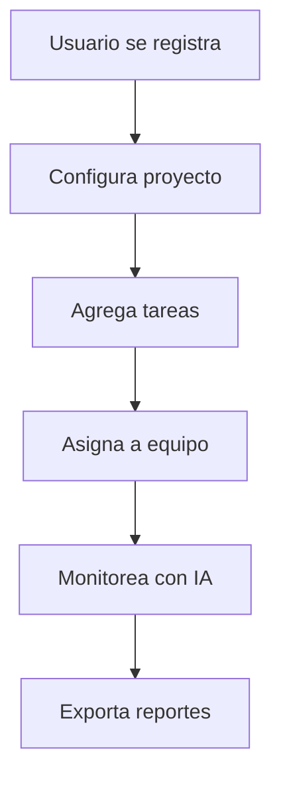

# PROGRESO DE LOS PROYECTOS DEL TERCER SEMESTRE

## PROGRAMACIÓN III - Proyecto Integrador (Python)
- *Link al repositorio con su respectivo README*: https://github.com/PowerSystem2024/CapybaraFilms_ProyectoTercerSemestre.git

---

## INGLÉS II - Proyecto (Video en Inglés)
| 📌 Task                | 👥 Assigned To       | 📊 Status           | 🚀 Progress       | 📝 Notes                          |
|-----------------------|---------------------|--------------------|------------------|----------------------------------|
| *🔍 Research*       | @Alex, @Jamie       | ✅ Completado      | 100%             | Fuentes verificadas              |
| *✍ Script*         | @Taylor             | 🟡 *En revisión* | 90%              | Esperando feedback               |
| *🎥 Recording*      | @Morgan, @Casey     | 🔴 *Pending*     | 30%  | Necesita locación                |
| *✂ Editing*        | @Riley              | ⏳ *Not Started* | 0%               | --                               |
| *🏆 Final Submission| @TeacherSmith       | ❓ **TBD*         | --               | Fecha límite: Junio 5            |

---

## METODOLOGÍA DE SISTEMAS - Proyecto StartUp

## 🚀 *Funcionalidades Clave*  

| Módulo                  | Descripción                                                                 | Estado          | Prioridad |
|-------------------------|-----------------------------------------------------------------------------|-----------------|-----------|
| *🔐 Registro/Login*   | Autenticación segura con roles (Usuario, Admin, Tutor)                     | ✅ *Live*     | Alta      |
| *📊 Tablero Kanban*   | Organización de tareas en columnas (To-Do, In Progress, Done) con drag & drop | 🟡 *Beta*     | Crítica   |
| *🤖 Asistente IA*     | Chatbot integrado para guía automática (responde dudas técnicas)            | 🔴 *En desarrollo* | Media   |
| *📅 Calendario*       | Sincronización con tareas y reuniones (Google Calendar, Outlook)            | 🟡 *Beta*     | Alta      |
| *📈 Reportes*         | Exportar resúmenes en PDF/CSV + gráficos de avance (Burn-down, KPIs)       | 🔴 *Backlog*  | Baja      |

---

## 🛠 *Roadmap Técnico*  

| Componente              | Tecnología           | Responsable   | Hito                            |
|-------------------------|----------------------|---------------|---------------------------------|
| *Frontend*            | React + TailwindCSS  | @DevFront     | MVP: Junio 2024                |
| *Backend*             | Node.js + Express    | @DevBack      | API Estable: Mayo 2024         |
| *Base de Datos*       | PostgreSQL           | @DBAdmin      | Migración Cloud: Julio 2024    |
| *IA (Chatbot)*        | OpenAI + LangChain   | @AIEngineer   | Entrenamiento: Agosto 2024     |

---

## 📌 *Casos de Uso Principales*  

