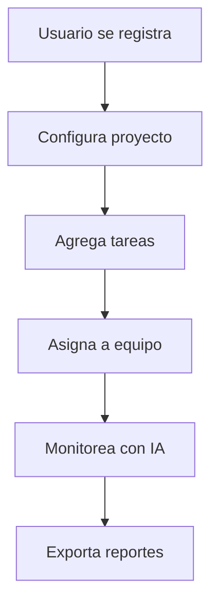

# PROGRESO DE LOS PROYECTOS DEL TERCER SEMESTRE

**Leyenda de Estados**:  
- ✅ **Completo**: Tarea finalizada y validada.  
- 🔍 **En pruebas**: En fase de testing/QA.  
- 🚧 **En progreso**: Desarrollo activo.  
- ⌛ **Pendiente**: Esperando recursos/aprobación.  
- 🗑️ **Eliminada**: Descarta (sin impacto en el sistema). 

## PROGRAMACIÓN III - Proyecto Integrador (Python)
- *Link al repositorio con su respectivo README*: https://github.com/PowerSystem2024/CapybaraFilms_ProyectoTercerSemestre.git

---

## INGLÉS II - Proyecto (Video en Inglés)
| 📌 Tarea                  | 📊 Estado          |
|---------------------------|---------------------|
| *🔍 Elección de Proyecto* | ✅ **Completo**    |
| *📝 Guión*                | ✅ **Completo**   |
| *🎥 Grabación*            | ✅ **Completo**  |
| *✂ Edición*               | ✅ **Completo**   | 
| *🏆 Entrega*              | ✅ **Completo**    | 

---

## METODOLOGÍA DE SISTEMAS - Proyecto StartUp

- *Link al espacio de trabajo* : https://github.com/Capy-Do

### 🎯 *Funcionalidades Clave*  

| Módulo                  | Descripción                                                                 | Estado          | Prioridad |
|-------------------------|-----------------------------------------------------------------------------|-----------------|-----------|
| *🔐 Registro/Login*   | Autenticación segura con roles (Usuario, Admin, Tutor)                     | ✅ *Live*     | Alta      |
| *📊 Tablero Kanban*   | Organización de tareas en columnas (To-Do, In Progress, Done) con drag & drop | 🟡 *Beta*     | Crítica   |
| *🤖 Asistente IA*     | Chatbot integrado para guía automática (responde dudas técnicas)            | 🔴 *En desarrollo* | Media   |
| *📅 Calendario*       | Sincronización con tareas y reuniones (Google Calendar, Outlook)            | 🟡 *Beta*     | Alta      |
| *📈 Reportes*         | Exportar resúmenes en PDF/CSV + gráficos de avance (Burn-down, KPIs)       | 🔴 *Backlog*  | Baja      |

### 🚀 *Estado actual del proyecto*

✅ Definición de Requisitos: Completamos las historias de usuario y casos de uso para entender las necesidades de los usuarios.

✅ Diseño de Procesos (BPMN): Modelamos los flujos de trabajo con Bizagi para optimizar las interacciones.

✅ Diseño de Arquitectura y Estructura: Definimos cómo se organizarán los componentes y datos de la aplicación.

> `🚧 En progreso` Diseño de Interfaz y Experiencia (UI/UX): Actualmente estamos diseñando la app en Figma para una experiencia intuitiva y visualmente atractiva.

> Modelado UML: Será nuestro siguiente paso para detallar la estructura y el comportamiento del sistema.

> Desarrollo: Comenzaremos a programar una vez finalizadas las fases de diseño.

---

### 🛠 *Roadmap Técnico*  

| Componente              | Tecnología           | Responsable   | Hito                            |
|-------------------------|----------------------|---------------|---------------------------------|
| *Frontend*            | React + TailwindCSS  | @DevFront     | MVP: Junio 2024                |
| *Backend*             | Node.js + Express    | @DevBack      | API Estable: Mayo 2024         |
| *Base de Datos*       | PostgreSQL           | @DBAdmin      | Migración Cloud: Julio 2024    |
| *IA (Chatbot)*        | OpenAI + LangChain   | @AIEngineer   | Entrenamiento: Agosto 2024     |

---

### 📌 *Casos de Uso Principales*  

